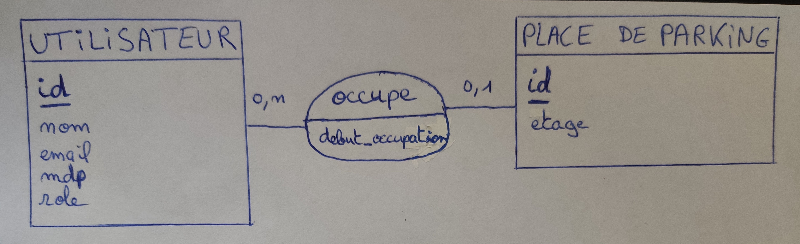
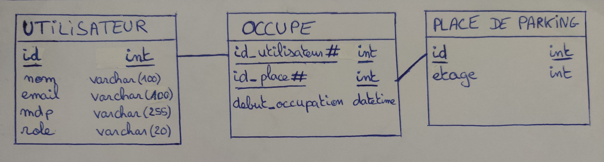

# ParkManager API
#### -- by Joaquim Dimitrov  

## Main features

- Login / Register with security and jwt (cookies) 
- Public and Admin roles 
- Users can access, see, change or delete their profile information 
- Admins can create and control parking spaces and see occupancy information 
- Spaces have a number(id) and a floor / We can see if a space is available or not and for how long they have been taken 
- Any registered and logged in user can search and take an available parking space for his car 
- Users can see where they have parked their car and remove it from there 

## Technologies used

- Node.js w/ express, bcrypt, jwt, ... 
- MySQL / PhPMyAdmin 
- HTML / CSS / Bootstrap / JS + Handlebars.js as templating engine 
- Model View Controller Architecture for code organisation 

## Available Scripts

In the project directory, you can run:

#### `npm start` or `yarn start`

It runs the app in the development mode.
Open [http://localhost:5000](http://localhost:5000) to view it in the browser.

Nodemon allows you to make changes without rerunning the project (just refresh the page). 

## Bases de données

#### Modèle entité association :

 

#### Modèle physique des données :

 

*Afin de savoir si une place est disponible, on n'utilise pas d'attribut "disponible" dans l'entité "place de parking" contrairement à ce que l'on pourrait penser, car si l'on supprime un utilisateur les places qu'il occupait seront toujours indiquées comme non-disponible.
Pour connaître sa disponibilité, on regarde s'il existe une relation entre ladite place et un utilisateur : une place est occupée si l'on retrouve son id dans la table intermédiaire "occupe" (clef étrangère "id_place#").

Le taux d'occupation du parking lui pourra être connu en prenant le nombre de places dans la table "occupe" divisé par 100, le tout multiplié par le nombre total de places dans "places de parking" : taux&nbsp;occupation&nbsp;= (places&nbsp;occupées&nbsp;x&nbsp;100) / total&nbsp;places&nbsp;dans&nbsp;le&nbsp;parking

## Screenshots

[soon]